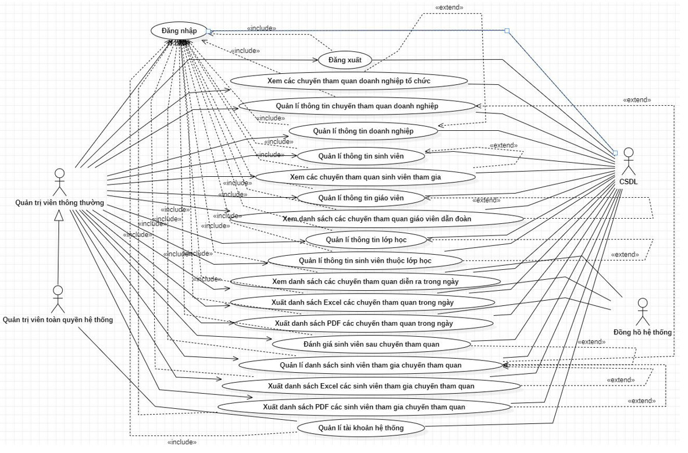
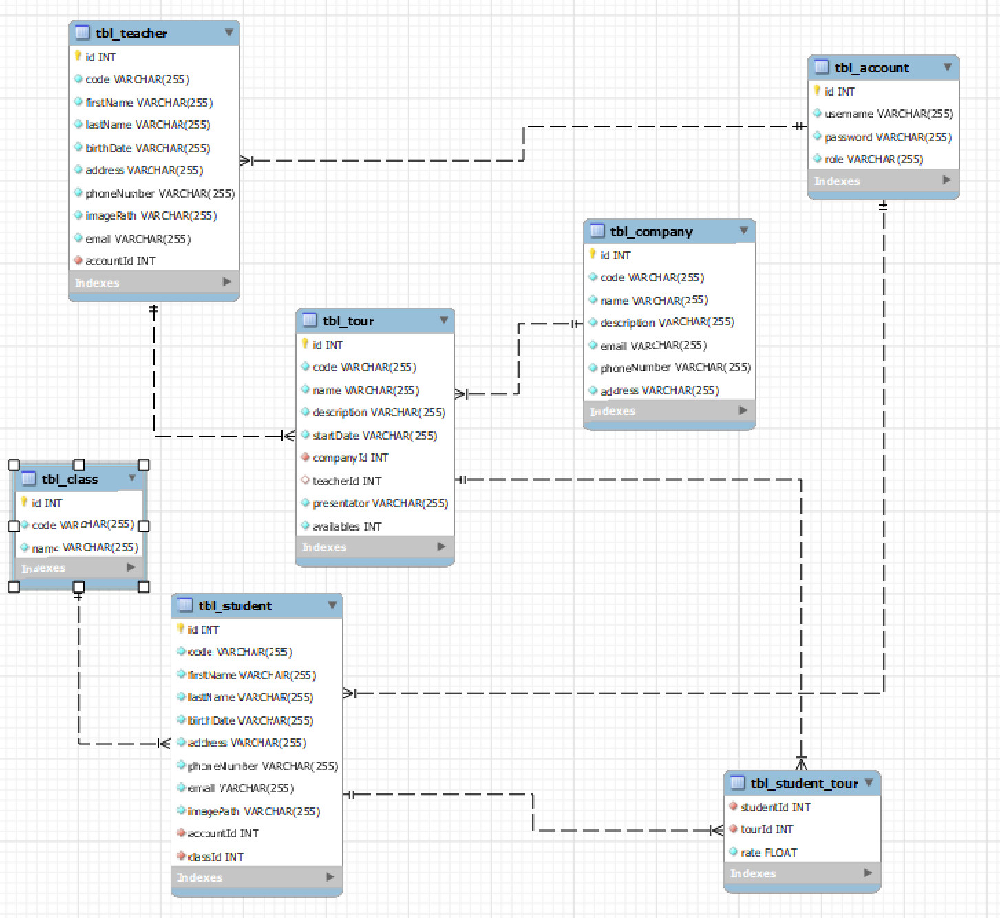

# Ứng dụng quản lý các chuyến tham quan của sinh viên và giáo viên
## 1. Phân tích hệ thống

### 1.1. Các giao diện chính
⮚  Chức năng chung : 
Ứng dụng cho phép sinh viên và giáo viên tham gia đăng ký tham gia chuyến du lịch sắp diễn ra. 
Đồng thời Admin của ứng dụng có vai trò quản lý, cập nhật thông tin các tài khoản, dữ liệu có thể được thống kê và xuất file PDF, EXCEL.

⮚	Hệ thống gồm 16 giao diện chính:

○	Giao diện Đăng nhập

○	Giao diện Trang chủ (admin và user)

○	Giao diện Quản lý giáo viên

○	Giao diện xem danh sách chuyến tham quan của giáo viên

○	Giao diện Quản lý sinh viên

○	Giao diện Chuyến tham quan sinh viên tham gia

○	Giao diện Quản lý các chuyến tham quan doanh nghiệp

○	Giao diện danh sách sinh viên tham gia chuyến tham quan

○	Giao diện Quản lý doanh nghiệp liên kết

○	Giao diện các chuyến tham quan tới doanh nghiệp liên kết

○	Giao diện Quản lý lớp học

○	Giao diện danh sách sinh viên của lớp học

○	Giao diện tài khoản cá nhân

○	Quản lý tài khoản

○	Giao diện đánh giá sinh viên sau mỗi chuyến tham quan
### 1.2. Biểu đồ Usecase

### 1.3. Sơ đồ quan hệ giữa các bảng 

## 2. Giao diện hệ thống

### 2.1. Giao diện tải app

*Giao diện loadscreen app*

### 2.2. Giao diện đăng nhập

*Giao diện đăng nhập của admin và user*

### 2.3. Giao diện admin

